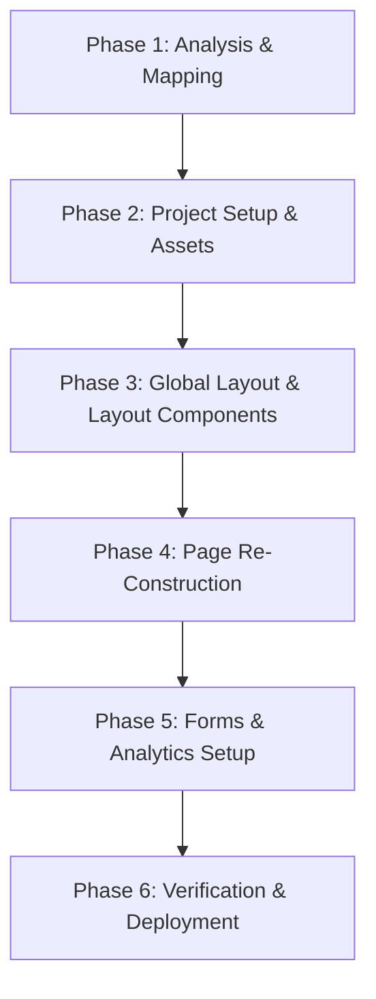

# Next.js Migration Roadmap

This document outlines the phased plan for migrating the clinic website from WordPress/PHP to Next.js, preserving all visual design, layout, content, and SEO properties.

---

## Migration Plan Overview

---

## Detailed Phases

### Phase 1: Analysis (Completed)
* **Objective**: Mapped the site pages, navigation, active plugins, custom scripts/CSS, media upload patterns, and SEO data.
* **Deliverables**: Generated inventory logs and technical documentation in the `docs/` folder.

### Phase 2: Project Setup & Asset Migration
* **Objective**: Prepare Next.js directory and copy static files.
* **Tasks**:
  * Set up Next.js skeleton structure using App Router or Pages Router (as instructed by the Lead).
  * Migrate custom stylesheets (`common.css`, `style.css`, `responsive.css`, `bootstrap.min.css`) to the Next.js global styling folder.
  * Extract custom web fonts and FontAwesome files, moving them to `/public/fonts/`.
  * Extract uploaded images from `public_html.zip` and place them in the `/public/uploads/` directory, keeping directory naming conventions.

### Phase 3: Global Layout & Core Components
* **Objective**: Reconstruct the global chrome and reusable UI parts.
* **Tasks**:
  * Build the parent `Layout` wrapper (including GTM integration).
  * Code the `<Header />` component (with drop-down hover triggers and mobile burger menu toggle).
  * Code the `<Footer />` component (incorporating contact details, social links, and the back-to-top script).

### Phase 4: Page Re-Construction
* **Objective**: Migrate page layouts.
* **Tasks**:
  * Migrate the Homepage (`/`), focusing on the Swiper Banner slider and container structures.
  * Migrate inner treatment and service informational pages (static JSX content).
  * Migrate dynamic pages (FAQ accordion list, Facilities grid, Blog index page reading local JSON/Markdown posts).

### Phase 5: Forms & Analytics Setup
* **Objective**: Integrate contact features and Google tags.
* **Tasks**:
  * Code custom React form components matching WPForms fields.
  * Integrate client-side validation.
  * Implement GTM (`GTM-KVLJB48V`) script tags using `next/script`.
  * Set up environment variables to make the eventual CRM API endpoint toggleable.

### Phase 6: Verification & Deployment
* **Objective**: Quality assurance and Vercel hosting setup.
* **Tasks**:
  * Perform responsive testing across layout breakpoints (`1200px`, `992px`, `767px`).
  * Verify identical visual representation of typography, colors, padding, and spacing.
  * Run build/lighthouse tests to check page optimization.
  * Connect to Vercel and verify production deploy logs.
