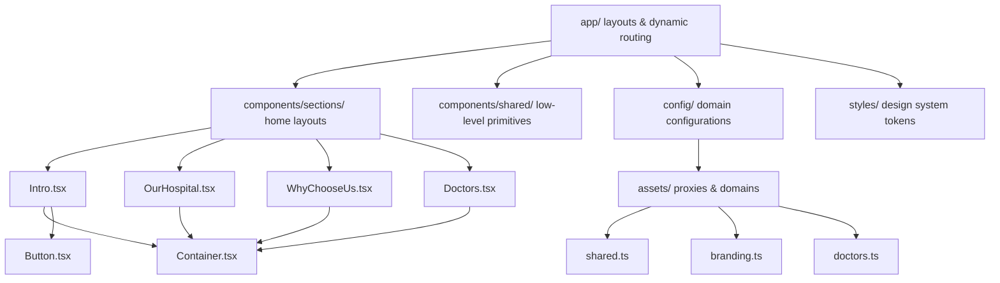

# Pre-Production Architecture Review & Technical Debt Assessment
**Project:** Next.js Migration Architecture  
**Author:** Staff Software Architect  
**Status:** Under Review  
**Date:** August 5, 2026  

---

## 1. Executive Summary

This architecture review assesses the status of the migration from WordPress/Elementor to a React/Next.js environment. The project foundation has achieved significant milestones: establishing a scoped asset architecture, setting up a shared design system foundation, extracting core layout components, and modernizing major layout sections of the Homepage (e.g., `Intro`, `OurHospital`, `WhyChooseUs`, and `Doctors`). 

The codebase shows strong alignment with modern Next.js practices, but key areas of technical debt remain. Specifically, dynamic pages, slider interactions (Hero slides, Testimonials, Blogs carousels), and media layouts still depend on global layout rules or legacy markup configurations.

---

## 2. Architecture Diagram

The diagram below maps the current layout flow and dependency hierarchy of the application:

---

## 3. Core Review Areas

### A. Project Structure & Organization
*   **Separation of Concerns**: Good. Component folders are cleanly separated into `layout/` (Header, Footer), `sections/` (feature slices by page), and `shared/` (atomic components).
*   **Consistency**: Strong naming conventions are maintained (`UpperCamelCase` for components, `.module.css` for local styles, `lowerCamelCase` for variables).
*   **Scalability**: High. By segmenting features into directory slices, developers can modify isolated styles without side effects on adjacent components.

### B. Component Architecture
*   **Coupling/Cohesion**: Most refactored sections have low coupling. However, the homepage `Hero` slider, `Blogs` carousel, and `Testimonials` remain highly coupled to `Home.module.css` and Swiper dependencies.
*   **Oversized Components**: `Hero.tsx` and `Testimonials.tsx` require refactoring to decouple Swiper initialization logic from presentation views.

### C. CSS Architecture
*   **Design System Integration**: High-quality integration of HSL colors, z-index indices, and transitions in `app/styles/tokens.css`.
*   **CSS Module Quality**: Refactored modules (`Footer`, `OurHospital`, `WhyChooseUs`, `Doctors`) scope layout rules cleanly. Some global styles remain in `Home.module.css` waiting for Phase 3 and Phase 4 migrations.

### D. Asset Architecture
*   **Asset Registry**: Successfully implemented. Central registry files under `config/assets/` proxy references correctly.
*   **WordPress Leftovers**: Residual static paths pointing to `/wp-content/uploads/` remain in non-refactored slider and subpage components.

### E. Configuration & Constant Registry
*   **Registry Proxy**: Domain configurations in `config/assets.ts` route variables smoothly.
*   **Magic Strings**: Removed from refactored components, but still present in non-refactored subpages (dynamic text and paths).

### F. Shared Primitives Audit
*   **API Quality**: Shared components (`Button`, `Container`, `Badge`, `SectionHeader`) exhibit clean API parameters.
*   **Reuse Opportunities**: Opportunities exist to swap out hardcoded headers in `Intro.tsx` and `WhyChooseUs.tsx` with `<SectionHeader />`.

---

## 4. Technical Debt Matrix

| Category | Component / Resource | Risk Classification | Architectural Impact |
| :--- | :--- | :---: | :--- |
| **Dead CSS** | Residual selectors in `Home.module.css` | Medium | Increases overall stylesheet bundle weight. |
| **Hardcoded Images** | Dynamic paths in slider backgrounds | High | Direct links to WordPress uploads risk broken assets. |
| **Elementor Wrappers** | Nested containers inside `WhyChooseUs` cards | Low | Minor DOM depth inflation. |
| **Coupled JS Hooks** | Swiper configs in page layouts | Medium | Hinders component testability. |
| **Inconsistent Buttons** | Anchor links masquerading as buttons | Low | Minor semantic visual variations. |

---

## 5. Production Readiness Scorecard

1.  **Maintainability: 8.5 / 10**  
    *Justification*: Modular stylesheets and shared components make isolating styling changes straightforward.
2.  **Scalability: 8.0 / 10**  
    *Justification*: Clear separation of feature folders makes onboarding new developers efficient.
3.  **Readability: 9.0 / 10**  
    *Justification*: Strict styling boundaries and TypeScript types minimize runtime code confusion.
4.  **Consistency: 8.5 / 10**  
    *Justification*: Naming patterns are followed across components.
5.  **Extensibility: 7.5 / 10**  
    *Justification*: Subpages require further modernization to be fully extensible.
6.  **Developer Experience: 8.0 / 10**  
    *Justification*: Prerendering pages is fast, though legacy global CSS leaks require caution.

---

## 6. Recommended 4-Phase Roadmap

### Phase 1: Slider Logic Refactoring (REF-014)
*   **Scope**: Modernize homepage main slider (`Hero.tsx`) and `Testimonials.tsx` carousels.
*   **Action**: Decouple Swiper navigation and bullet rules into scoped CSS module configs.
*   **Deployment**: Independent UI deploy.

### Phase 2: Nephrology & Facilities Grid Layouts (REF-015)
*   **Scope**: Modernize remaining subpage lists and grids.
*   **Action**: Strip Elementor divs and wrap in `<Container>` layout helpers.
*   **Deployment**: Independent layout deploy.

### Phase 3: Blogs & Dynamic Slug Routes Asset Sync (REF-016)
*   **Scope**: Modernize blogs layouts under `/news-blogs/[slug]`.
*   **Action**: Swap hardcoded images for central registry references.
*   **Deployment**: Independent metadata route deploy.

### Phase 4: Final Legacy Cleanups (REF-017)
*   **Scope**: Clean up unused assets, purge `Home.module.css` files, and verify zero dependencies on `/wp-content/`.
*   **Action**: Final compilation testing.
*   **Deployment**: Production launch.

---

## 7. Top 10 Priorities
1.  Isolate slider CSS overrides in `Hero.module.css`.
2.  Route all slider background imagery through the asset registry.
3.  Rewrite `/news-blogs/[slug]` to use dynamic paths variables.
4.  Modernize testimonial feedback slides to native React.
5.  Consolidate utility CSS rules into `utilities.css`.
6.  Standardize heading weights across all page sections.
7.  Swap custom buttons for `<Button />` variants.
8.  Clean up remaining dynamic routes links.
9.  Run semantic audits on header navigation controls.
10. Finalize regression test suites.

---

## 8. Risk Assessment

*   **CSS Cascade Override Risk**: Low. Restricting scopes with CSS Modules protects layout structures.
*   **Swiper Initialization Lag**: Medium. Carousel delays can cause minor CLS. Mitigation: Keep container dimensions static during prerendering.
*   **Hydration Mismatch Risk**: Low. Next.js Turbopack verifies consistency.
