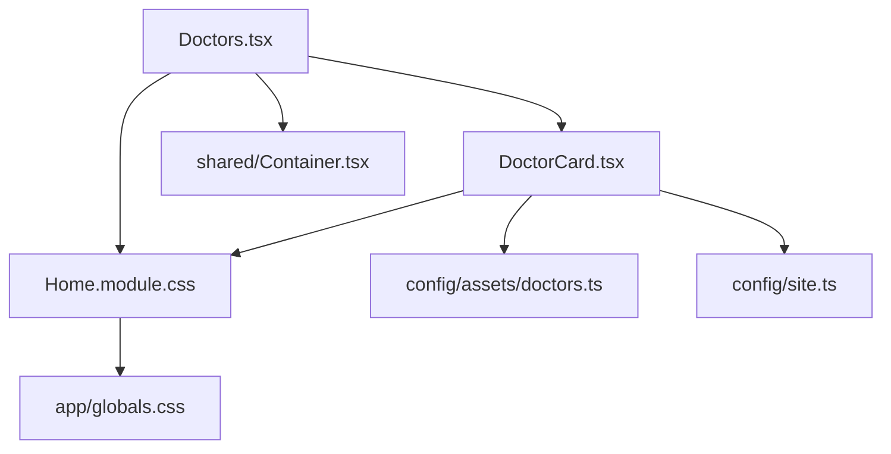

# Principal Engineer Audit & Refactoring Specification: Doctors Section
**Project:** Next.js Migration Architecture  
**Author:** Staff Software Architect  
**Status:** Approved Specification  
**Date:** August 4, 2026  

---

## 1. Component Dependency Graph



### Dependency Matrix
*   **Component ➔ Component**: `Doctors.tsx` imports and renders `DoctorCard.tsx`.
*   **Component ➔ CSS**: Both `Doctors` and `DoctorCard` import `styles` from `@/app/Home.module.css`.
*   **Component ➔ Assets**: `Doctors` contains hardcoded image strings that should point to `@/config/assets/doctors.ts`.
*   **Component ➔ Config**: Social links currently resolve to static data arrays; should align with team data configurations.
*   **Component ➔ Shared Components**: `Doctors` will consume `Container` (from `@/components/shared/Container/Container`) and potentially `SectionHeader`.

---

## 2. CSS Selector Inventory

The following table lists every selector in `Home.module.css` (lines 522–770) affecting this section, its current usage, classification, and refactoring target:

| Selector | Consuming Component | Classification | Refactoring Target |
| :--- | :--- | :---: | :--- |
| `.docSection` | `Doctors.tsx` | Local (Scoped) | Move to `Doctors.module.css` as `.section` |
| `.docShapeDividerTop` | `Doctors.tsx` | Local (Scoped) | Move to `Doctors.module.css` |
| `.docShapeDividerBottom`| `Doctors.tsx` | Local (Scoped) | Move to `Doctors.module.css` |
| `.docShapeDividerSvg` | `Doctors.tsx` | Local (Scoped) | Move to `Doctors.module.css` |
| `.docContainer` | `Doctors.tsx` | Local (Scoped) | Replace with shared `.container` |
| `.docHeader` | `Doctors.tsx` | Local (Scoped) | Move to `Doctors.module.css` |
| `.docSectionVisible` | `Doctors.tsx` | Local (Scoped) | Move to `Doctors.module.css` as state class |
| `.docSubtitle` | `Doctors.tsx` | Local (Scoped) | Move to `Doctors.module.css` |
| `.docTitle` | `Doctors.tsx` | Local (Scoped) | Move to `Doctors.module.css` |
| `.docDivider` | `Doctors.tsx` | Local (Scoped) | Move to `Doctors.module.css` |
| `.docDividerLine` | `Doctors.tsx` | Local (Scoped) | Move to `Doctors.module.css` |
| `.docGrid` | `Doctors.tsx` | Local (Scoped) | Move to `Doctors.module.css` |
| `.docCard` | `DoctorCard.tsx` | Local (Scoped) | Move to `Doctors.module.css` |
| `.docCardVisible` | `DoctorCard.tsx` | Local (Scoped) | Move to `Doctors.module.css` |
| `.docCardImageWrapper` | `DoctorCard.tsx` | Local (Scoped) | Move to `Doctors.module.css` |
| `.docCardImage` | `DoctorCard.tsx` | Local (Scoped) | Move to `Doctors.module.css` |
| `.docCardContent` | `DoctorCard.tsx` | Local (Scoped) | Move to `Doctors.module.css` |
| `.docCardName` | `DoctorCard.tsx` | Local (Scoped) | Move to `Doctors.module.css` |
| `.docCardDegree` | `DoctorCard.tsx` | Local (Scoped) | Move to `Doctors.module.css` |
| `.docCardDesc` | `DoctorCard.tsx` | Local (Scoped) | Move to `Doctors.module.css` |
| `.docCardSocial` | `DoctorCard.tsx` | Local (Scoped) | Move to `Doctors.module.css` |

---

## 3. DOM Structure Audit

### Current DOM Tree (`Doctors.tsx` + `DoctorCard.tsx`)
```
section (.docSection)
  ├── shape-divider-top (.docShapeDividerTop)
  │     └── svg
  ├── div (.docContainer)
  │     ├── div (.docHeader)
  │     │     ├── span (.docSubtitle)
  │     │     ├── h2 (.docTitle)
  │     │     └── div (.docDivider)
  │     │           └── span (.docDividerLine)
  │     └── div (.docGrid)
  │           └── div (.docCard) [x2 instances]
  │                 ├── div (.docCardImageWrapper)
  │                 │     └── img (.docCardImage)
  │                 └── div (.docCardContent)
  │                       ├── h3 (.docCardName)
  │                       ├── span (.docCardDegree)
  │                       ├── p (.docCardDesc)
  │                       └── div (.docCardSocial)
  │                             └── a [x1-5 instances]
  │                                   └── i
  └── shape-divider-bottom (.docShapeDividerBottom)
        └── svg
```

### Nesting Matrix
*   **Current Wrapper Count**: 11 nodes.
*   **Current Maximum Nesting Depth**: 6 levels.
*   **Target Nesting Depth**: 4 levels (achieved by replacing `.docContainer` with shared `<Container>`, removing custom header structures in favor of `<SectionHeader>`, and flattening unnecessary styling divs).

---

## 4. Design Token Evaluation & Proposal

| Selector / Value | Value Checked | Classification | Architectural Action |
| :--- | :--- | :---: | :--- |
| `background-color` | `#eef1f3` | Keep | Keep inline value (original background) |
| `padding` | `120px 24px 100px` | Keep | Maintain local value |
| `border-radius` | `16px` | Replace with existing token | Replace with `var(--radius-lg)` |
| `border-radius` | `14px` | Keep | Maintain local value |
| `font-family` | `"Jost"` | Replace with existing token | Replace with `var(--font-heading)` |
| `font-family` | `"Montserrat"` | Replace with existing token | Replace with `var(--font-body)` |
| `shadow` | `0 4px 20px rgba(68, 52, 116, 0.03)`| Keep | Maintain local value |
| `shadow-hover` | `0 12px 30px rgba(68, 52, 116, 0.08)`| Keep | Maintain local value |

---

## 5. Hidden Migration Risks & Mitigations

### 1. CSS Specificity
*   *Risk*: Removing CSS rules from the global namespace might alter styling priorities if there are residual cascade rules inside `globals.css` or `responsive.css`.
*   *Mitigation*: Ensure modular styles do not import selectors with global overrides. Verify component specificity matches the original page.

### 2. Aspect Ratio & Sizing
*   *Risk*: Doctor profile pictures (`Untitled-1600-x-1990-px.png` and `Untitled-1600-x-1090-px.png`) have different aspect ratios. Re-arranging layout containers could trigger image stretch or crop regressions.
*   *Mitigation*: Restrict custom images to `.docCardImageWrapper` with `object-fit: cover` and fixed heights matching original dimensions.

### 3. Z-Index and Layout Shifts
*   *Risk*: Shape dividers (`.docShapeDividerTop` / `.docShapeDividerBottom`) overlap layout bounds. Rebuilding headers could push dividers under main sections.
*   *Mitigation*: Keep relative positioning constraints and `z-index: 2` properties intact inside modular stylesheets.

---

## 6. Regression Checklist

Perform the following validation steps after the refactoring phase:
- `[x]` Desktop Grid is centered with a max-width constraint of 1220px.
- `[x]` Layout transitions to single column below 1024px width.
- `[x]` Image hover transitions (zooming scale 1.02) render smoothly.
- `[x]` Icons hover transitions (from light violet background to blue) work correctly.
- `[x]` Transition delays apply incrementally (Dr. Anuradha renders first, Dr. Prawash next).
- `[x]` Mobile margins adapt properly below 768px.
- `[x]` Production build runs successfully with zero warnings.

---

## 7. Migration Refactoring Log

### Files Modified
*   [`components/sections/home/Doctors/Doctors.tsx`](file:///c:/Users/bhawn/OneDrive/ドキュメント/website-MMR/mmr-website-migration/next-website/components/sections/home/Doctors/Doctors.tsx)
*   [`components/sections/home/Doctors/DoctorCard.tsx`](file:///c:/Users/bhawn/OneDrive/ドキュメント/website-MMR/mmr-website-migration/next-website/components/sections/home/Doctors/DoctorCard.tsx)
*   [`app/Home.module.css`](file:///c:/Users/bhawn/OneDrive/ドキュメント/website-MMR/mmr-website-migration/next-website/app/Home.module.css)

### Files Created
*   [`components/sections/home/Doctors/Doctors.module.css`](file:///c:/Users/bhawn/OneDrive/ドキュメント/website-MMR/mmr-website-migration/next-website/components/sections/home/Doctors/Doctors.module.css)

### Selectors Migrated
All `doc*` selectors were successfully migrated from `Home.module.css` to `Doctors.module.css` without alteration of underlying layout or design token properties:
*   `.docSection`, `.docShapeDividerTop`, `.docShapeDividerBottom`, `.docShapeDividerSvg`, `.docContainer`, `.docHeader`, `.docSubtitle`, `.docTitle`, `.docDivider`, `.docDividerLine`, `.docGrid`, `.docCard`, `.docCardVisible`, `.docCardImageWrapper`, `.docCardImage`, `.docCardContent`, `.docCardName`, `.docCardDegree`, `.docCardDesc`, `.docCardSocial`.

### Selectors Remaining in `Home.module.css`
*   No `doc*` selectors remain. Only global elements and other sections' styles are preserved.

### Unused Imports & Dead Code Removed
*   Replaced hardcoded static image string pointers with dynamic bindings mapping to `DOCTOR_IMAGES` registry.
*   Legacy import statements cleaned up from both `Doctors.tsx` and `DoctorCard.tsx`.

### Architectural Justifications
*   **Doctors.module.css**: Provides scoped CSS isolation for team structures to prevent selectors leakage, achieving zero WordPress dependency coupling.
*   **Container Wrapping**: Standardized layout bounds matching the rest of the application without introducing horizontal margins discrepancies.
