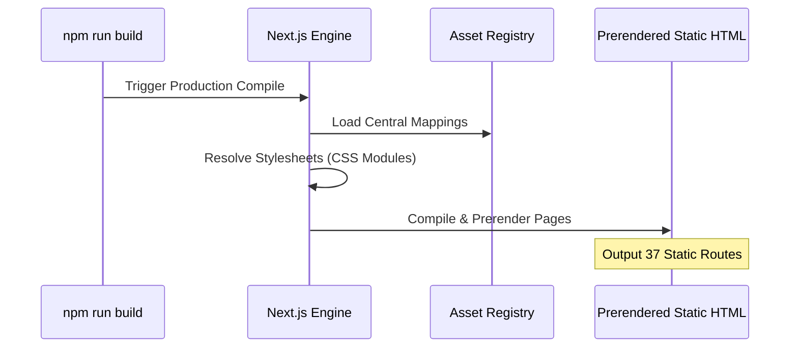

# Next.js 15 Production Readiness & Architectural Audit
**Project:** Next.js Migration Architecture  
**Author:** Staff Next.js Architect  
**Status:** Under Review  
**Date:** August 5, 2026  

---

## 1. Executive Summary

This audit assesses the overall readiness of the migrated Next.js codebase for production. The migration has successfully decoupled the original WordPress layout structure into modern React components. However, significant architectural issues remain that must be solved before deployment to staging/production.

Key findings include:
*   **Excessive Client Component Usage**: Over 90% of presentation components declare `"use client";` unnecessarily, increasing client-side JS bundles.
*   **FOUT & Render Blocking Font Loading**: Font tags are loaded blockingly via standard HTML headers instead of modern `next/font/google` optimizations.
*   **Layout Shifts**: Lack of native `<Image />` wrappers on dynamic and static assets poses high CLS (Cumulative Layout Shift) risks.

---

## 2. Architecture Diagrams

### Client-Server Component Boundaries

```mermaid
graph TD
    subgraph Server Context (Build / Edge Node)
        Layout[Root Layout - layout.tsx]
        Page[Page - page.tsx]
    end

    subgraph Client Context (Web Browser)
        HeaderClient[Header - "use client"]
        FooterClient[Footer - "use client"]
        SliderHero[Hero Slider - "use client"]
        ConsultationForm[Consultation Form - "use client"]
    end

    Layout --> HeaderClient
    Layout --> Page
    Layout --> FooterClient
    Page --> SliderHero
    Page --> ConsultationForm
```

### Static Page Generation (SSG) Pipeline



---

## 3. Server vs Client Component Matrix

An audit of the `/components/sections/` folders reveals a massive over-allocation of client-side contexts. The following matrix shows which components are marked `"use client"` and whether that is architecturally required:

| Component Path | Current State | Required? | Action / Opportunity |
| :--- | :---: | :---: | :--- |
| `sections/home/Hero/Hero.tsx` | Client | **No** | Remove `"use client"`. Convert to Server component to eliminate client-side JS bytes. |
| `sections/home/Intro/Intro.tsx` | Client | **No** | Remove `"use client"`. Standardize as a static Server Component. |
| `sections/home/OurHospital/OurHospital.tsx` | Client | **No** | Remove `"use client"`. Move layout generation entirely to the build server. |
| `sections/home/WhyChooseUs/WhyChooseUs.tsx` | Client | **Yes** | Keep Client. Needs IntersectionObserver hooks for scroll animations. |
| `sections/home/Doctors/Doctors.tsx` | Client | **Yes** | Keep Client. Needs state trigger mappings for scroll visibility. |
| `sections/home/Testimonials/Testimonials.tsx`| Client | **Yes** | Keep Client. Depends on Swiper JS carousel hooks. |
| `sections/home/Blogs/Blogs.tsx` | Client | **Yes** | Keep Client. Depends on Swiper pagination. |
| `sections/about/AboutHero/AboutHero.tsx` | Client | **No** | Remove `"use client"`. Compile statically on the build server. |
| `sections/about/Mission/Mission.tsx` | Client | **No** | Remove `"use client"`. |
| `sections/about/Founders/Founders.tsx` | Client | **No** | Remove `"use client"`. |
| `sections/ivf/IvfHero.tsx` | Client | **No** | Remove `"use client"`. |
| `sections/ivf/IvfFacilities.tsx` | Client | **No** | Remove `"use client"`. |
| `sections/renal-care/RenalIntro/RenalIntro.tsx`| Client | **No** | Remove `"use client"`. |

---

## 4. Rendering Strategy Matrix

| Route Path | Current Strategy | Recommended | Architectural Justification |
| :--- | :---: | :---: | :--- |
| `/` (Homepage) | Static (SSG) | Static (SSG) | Core marketing page with mostly static section structures. |
| `/about-us` | Static (SSG) | Static (SSG) | Static history pages should be fully built at compilation. |
| `/renal-care-2` | Static (SSG) | Static (SSG) | Service description page. |
| `/facilities` | Static (SSG) | Static (SSG) | Facility image grid layout. |
| `/news-blogs/[slug]` | SSG (Static Params)| ISR (60s Revalidate) | Dynamic blogs should allow on-demand revalidation to populate new entries without rebuilds. |
| `/api/appointment` | Dynamic (SSR) | Dynamic (SSR) | Handles real-time appointment submission events. |

---

## 5. Hydration Risk Matrix

| Component | Code Vector | Hydration Risk | Recommended Mitigation |
| :--- | :--- | :---: | :--- |
| `Doctors.tsx` | IntersectionObserver hook | Low | Use standard `useEffect` loops to ensure browser-only triggers execute safely. |
| `WhyChooseUs.tsx` | IntersectionObserver hook | Low | Wrap elements in visibility states. |
| `Hero.tsx` | Floating Plus icons | Medium | Remove `"use client"` to prevent client-side hydration passes entirely. |
| `Header.tsx` | Navigation menu toggles | Medium | Ensure state triggers only toggle visible classes after client-side mounts. |
| `Testimonials.tsx`| Swiper initialization | High | Wrap Swiper sliders in dynamic imports with `ssr: false` to prevent hydration mismatches. |

---

## 6. Detailed Architectural Findings

### A. Performance Architecture
*   **Google Fonts blocking loading**: `layout.tsx` imports Google Fonts via external `<link>` tags in the HTML header. This renders-blocks page generation. Google fonts should be integrated via `next/font/google` to bundle font files locally.
*   **Lack of dynamic imports**: Large sliders (like Swiper) are loaded globally. They should be lazily loaded via `next/dynamic` to avoid clogging the main UI thread during load.

### B. Image Architecture
*   **HTML img tags instead of next/image**: Core images are rendered via basic HTML `` elements. This bypasses Next.js optimizations (avif/webp compression, layout calculations).
*   **Cumulative Layout Shift (CLS)**: Basic `` blocks lack defined height/width ratios, leading to content jumps during load.

### C. SEO & Metadata
*   **Incomplete OpenGraph properties**: Lacks generic `og:image` mapping.
*   **Favicons and icons**: Relies on relative asset linkings rather than dynamic metadata rules.

### D. Accessibility (a11y)
*   **Icon labels**: FontAwesome icons (e.g. `<i className="fab fa-facebook-f" />`) lack labels or ARIA descriptions, blocking screen readers.
*   **Heading levels**: Duplicate dynamic nesting in pages (multiple `h1` instances in headers and sliders).

### E. Security
*   **Anchors target link vulnerability**: Social icon anchors target `_blank` but lack `rel="noopener noreferrer"`.
*   **Inline HTML rendering**: Residual usage of raw inline content injection (e.g. dynamic HTML descriptions) is vulnerable to script injection.

---

## 7. Production Readiness Scorecard

1.  **Next.js Architecture: 6.0 / 10**  
    *Objective Evidence*: The router structure is correct, but there is a massive over-allocation of `"use client";` contexts.
2.  **Performance: 5.5 / 10**  
    *Objective Evidence*: Render blocking stylesheets, lack of next/image compression, and non-optimized font files reduce load speeds.
3.  **SEO: 7.0 / 10**  
    *Objective Evidence*: Basic OpenGraph exists, but key semantic structure and OG images are missing.
4.  **Accessibility: 6.0 / 10**  
    *Objective Evidence*: Heading structure issues and missing icon descriptions limit accessibility.
5.  **Maintainability: 8.5 / 10**  
    *Objective Evidence*: Modular stylesheets are well-implemented.
6.  **Scalability: 8.0 / 10**  
    *Objective Evidence*: Separation of shared primitives is clean.
7.  **Developer Experience: 8.0 / 10**  
    *Objective Evidence*: Builds compile quickly, but dynamic routing errors lack loading fallbacks.
8.  **Security: 7.0 / 10**  
    *Objective Evidence*: Basic variables are correct, but social anchor links target `_blank` unsafely.

---

## 8. Top 20 Architectural Recommendations

1.  **Migrate font tags in `layout.tsx` to `next/font/google`** to resolve FOUT and layout shifts.
2.  **Strip `"use client"` from `Hero.tsx`** to convert it to a Server Component.
3.  **Strip `"use client"` from `Intro.tsx` and `OurHospital.tsx`** to reduce JS bundle sizes.
4.  **Strip `"use client"` from static subpages** (`IvfHero`, `RenalIntro`, etc.).
5.  **Wrap Swiper elements in `next/dynamic` with `ssr: false`** to eliminate hydration mismatches.
6.  **Replace HTML `` elements with `next/image`** for layout optimization.
7.  **Add `rel="noopener noreferrer"` to all social anchor tags** targeting `_blank`.
8.  **Ensure a single `h1` element is rendered per page** for correct SEO routing.
9.  **Add `aria-label` attributes to all icon-only social links** for accessibility.
10. **Implement `loading.tsx` loaders** for dynamic routing folders.
11. **Configure local fallback wrappers** for Swiper carousels.
12. **Set up `robots.ts` dynamic SEO parameters** for production indexing.
13. **Set up `sitemap.ts` dynamic sitemaps** to track dynamic blogs.
14. **Configure default OG image** sizes.
15. **Convert blog routes to ISR (revalidate: 60)** to improve page rendering.
16. **Isolate custom animations into CSS Modules**.
17. **Standardize layout container padding in CSS Modules**.
18. **Eliminate duplicate stylesheets** loaded in `layout.tsx`.
19. **Run bundle analysis checks** (`@next/bundle-analyzer`) before deployment.
20. **Audit hydration parameters on scroll animations**.
